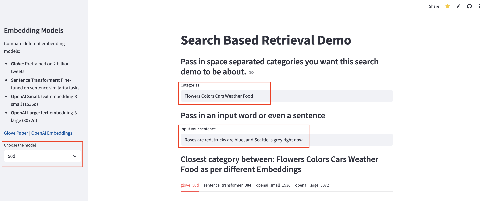
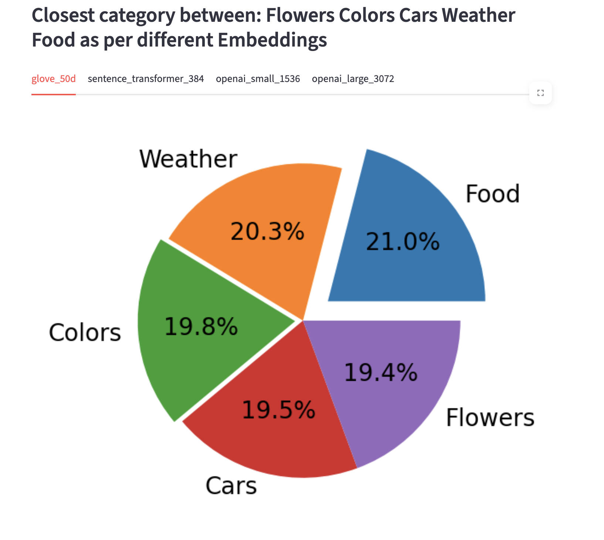
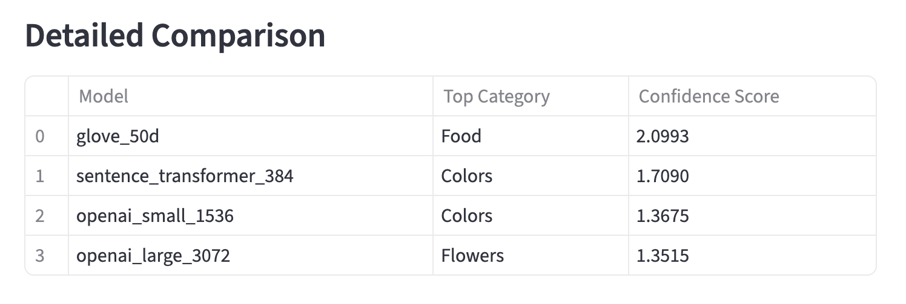

# LLMs-MiniProject-1

This repository contains the implementation for MiniProject 1 of the Large Language Models (LLMs) course at University of Washington, Winter 2026.

Details and instructions for the assignment can be found in  [README_STUDENT.md](README_STUDENT.md)

## Features
- **Input sentences and categories:** Enter categories (separated by spaces) and a sentence.
- **Model comparison:** View predictions from multiple embedding models (GloVe, Sentence Transformer, OpenAI).  
  - **GloVe dimensionality selection:** Choose between 25d, 50d, or 100d embeddings in the left sidebar (default is 50d).
- **Pie chart visualization:** Visualize the distribution of cosine similarity scores for all models.
- **Result table:** For each model, see the top predicted category and its confidence score.

1. User Inputs:


2. Pie Chart Visualization:
- Tab to view cosine similarity distributions for each model.


3. Result Table:



## Live Demo
You can view and interact with the deployed app here: https://llms-miniproject-1-xuxindi1220.streamlit.app/


## Local Development
To run the application locally, follow these steps:
1. **Clone the repository:**
   ```bash
   git clone git@github.com:xuxindi1220/LLMs-MiniProject-1.git
   ```
2. **Create a virtual environment (recommended):**
   ```bash
    python3 -m venv venv
    source venv/bin/activate  # Linux/macOS
    venv\Scripts\activate     # Windows
   ```
3. **Install dependencies:**
   ```bash
    pip install -r requirements.txt
   ```
4. **Set your OpenAI API key as an environment variable:**
   ```bash
    export OPENAI_API_KEY="your_openai_api_key"  # Linux/macOS
    set OPENAI_API_KEY="your_openai_api_key"     # Windows
   ```
5. **Run the Streamlit app:**
    ```bash
    streamlit run miniproject_1.py
    ```
6. **Open your web browser and navigate to:** http://localhost:8501


## Models Included

| Model                     | Description                                                                                                             |
|---------------------------|-------------------------------------------------------------------------------------------------------------------------|
| glove_25d/50d/100d	       | Pre-trained GloVe word embeddings                                                                                       |
| sentence_transformer_384	 | Sentence Transformer embedding (384-dim); Default model: https://huggingface.co/sentence-transformers/all-MiniLM-L6-v2  |
| openai_small_1536	        | OpenAI embedding (small)                                                                                                |
| openai_large_3072         | 	OpenAI embedding (large)                                                                                               |


## Analysis Report
Please refer to the [MiniProject_1_Part_1_Analysis.md](MiniProject_1_Part_1_Analysis.md) file for a detailed analysis of the model performances and insights gained from the experiments.